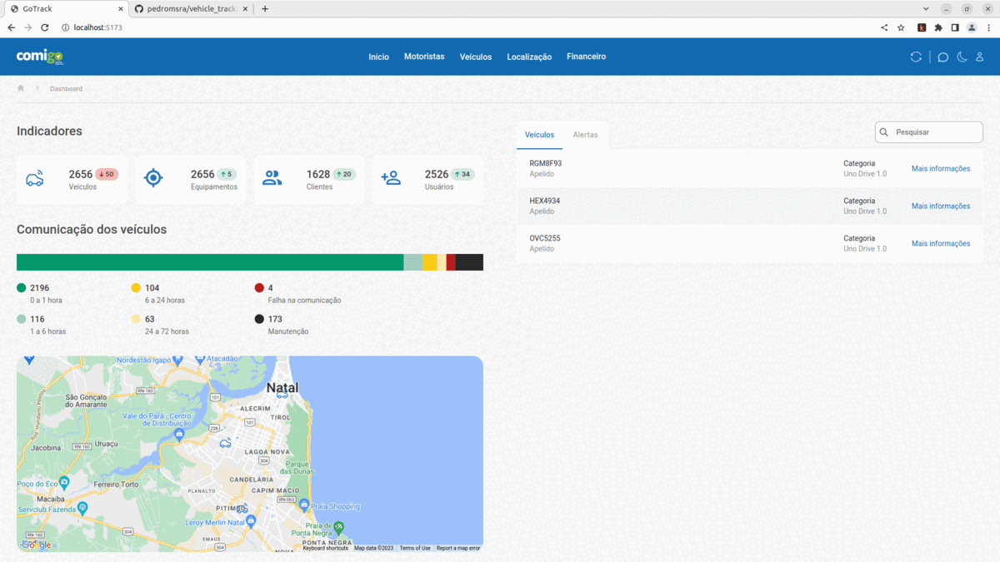
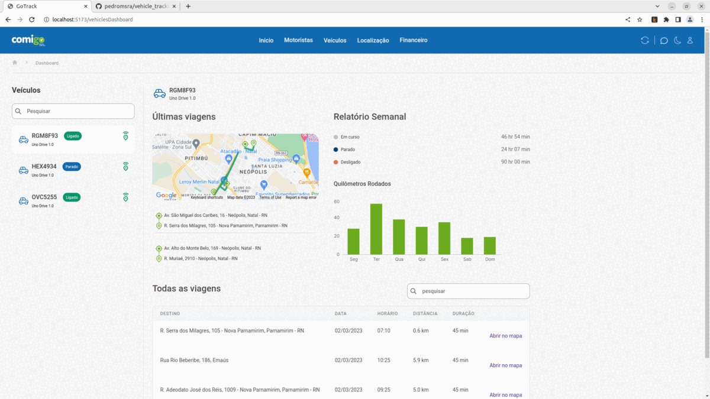
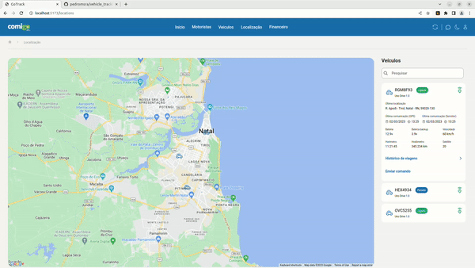

# CarTrack

## Apresentation

Fronted para aplicação WEB para rastreamento de veículos

- Desenvolvido em ReactJS v18.2.0;
- Ambiente de desenvolvimento construído com Vite v4.0.0;
- Préprocessador de CSS StyledComponents v5.3.6;
- Frontend não integrado à API específica, usou-se um JSON como informações de entrada;
- Integrou-se a API Google Maps com react-google-maps;
- Gráficos com Recharts;

## Primeiros passos

- [Diretorio do Gihub](https://github.com/pedromsra/rocketnotes_frontend);
- Seguir os passos do link [Clonar um repositório](https://github.com/pedromsra/vehicle_tracking_FrontEnd.git) para realizar o **git clone** da aplicação;
- Para os fins desse projeto será considerado que o [servidor local](http://localhost:5173) (padrão do vite);
- Abrir o terminal e digitar:
  - `$ cd /local_da_pasta_onde_a_aplicação_foi_salva`
  - `$ npm install`
  - `$ npm run dev`

## Páginas

Segue a imagens das páginas utilizadas nessa aplicação.

> Os componentes podem ser identificados nas imagens.

### Início



### Veículos



### Locations



## Componentes

> A documentação dos componentes irá cubrir a utilização dos componentes, qualquer personalização deverá ser realizada no arquivo "/src/assets/"componente"/styles.js" para cores, tipos e dimensões personalizadas. 

> No geral, os componentes recebem props como onClick = {...}, etc. 

> Os componentes MyMapComponent e DistributedChart terão uma sessão de comentário para a integração das respectivas bibliotecas/API

> Finalmente, terá uma sessão dentro de componentes voltada à explicação das bibliotecas geolib e geocode 

### Button

- Descrição: Botão simples em caixa, aceita ícone;
- Aplicação:

```html
    <Button title="Meu botão" isActive = "false" icon={iconeCarro} />
```

- Comentário:
  - Se o título não for informado, o botão irá aparecer em branco;
  - Em caso de ```isActive = "true"``` irá aparecer, no lugar do título, a palavra "loading...";

### ButtonText

- Descrição: Texto clicável, com função de input ```type = button```, aceita ícone;
- Aplicação:

```html
    <ButtonText title="Meu botão" icon={iconeCarro} />
```

- Comentário:
  - Se o título não for informado, o botão irá aparecer em branco;

### Header

- Descrição: Navbar com imagem do usuário e botão para logout;
- Aplicação:

```html
    <Header />
```

- Comentário: não é necessário props;

### Where

- Descrição: Abaixo da Navbar com demonstração de onde o usuário se encontra na aplicação, normalmente mostra um "ícone de casa" > "local";
- Aplicação:

```html
    <Where title="local" />
```

- Comentário: unico props necessário é o título da página;

### Input

- Descrição: input html usado para type = text, permite adicionar icone;
- Aplicação:

```html
    <Input icon = {myIcon} placeholder="My input" type = "text" />
```

- Comentários: é essencialmente um ```<input />```;

### DateInput

- Descrição: input html usado para type = text, permite adicionar icone;
- Aplicação: #Essencialmente igual ao Input, porém com modificações de estilização

```html
    <Input icon = {myIcon} placeholder="My input" type = "text" />
```

- Comentários: é essencialmente um ```<input />```;

### Section

- Descrição: Título de sessão, como Liks úteis ou Marcadores, apresenta-se com uma linha abaixo do nome;
- Aplicação: 

```html
    <Section title = "Liks úteis">
        {childrens}
    </Section>
```

- Comentário: 
  - o title irá definir o nome que irá aparecer;
  - O childrens é a informação que pode ser adicionada dentro da Section, como os Links ou Tags a serem salvos;

### InfoBox

### InfoBoxVehicle

### InfoBoxVehicleDetails

### Chart

### DistributedChart

- links relacionados;
- integração com api rechart;
- primeiros passos com rechart;
- configuração do gráfico;

### Indicador

### MyMapComponent

- links relacionados;
- integração com api google;
- primeiros passos react-google-maps;
- Polyline;
- Markers;

## Serviços

### Geolib

- links relacionados;
- explicação do uso;

### Geocode

- links relacionados;
- explicação do uso;